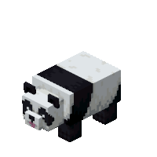

<h1 align="center"> Welcome to my profile!  </h1>

  

<h3>  I'm Soares | Junior Full-Stack Developer  </h3> 

I am passionate about technology, innovation, and building solutions that combine artificial intelligence, scalability, and high positive impact on society. I believe a good developer truly makes a difference.

- I'm a Front-End Freelancer: React, JavaScript, HTML, CSS
- Proane
- Currently studying Java and Spring Boot
- My goal is to become a Mid-Level Full-Stack Developer
- Pronouns: he/she
- Contact me at: a.soares2815@gmail.com
- I'm obsessed with horror games, books, manga, and theories.

 

<h2 align="center"> My Skills & Technologies </h2> 

### Frontend

### Backend

### Tools 

 

<table align="center">
<tr>
  <th colspan="2" align="center">
      My Stats 
  </th>
</tr>

<tr>
<td>

<picture>
  <source
    srcset="https://github-readme-stats.vercel.app/api?username=Alexyycb&show_icons=true&theme=midnight-purple&locale=en"
    media="(prefers-color-scheme: dark)"
  />
  <source
    srcset="https://github-readme-stats.vercel.app/api?username=Alexyycb&show_icons=true&theme=buefy&locale=en"
    media="(prefers-color-scheme: light)"
  />
  
</picture>

</td>

<td>

<picture>
  <source
    srcset="https://github-readme-stats.vercel.app/api/top-langs/?username=Alexyycb&layout=compact&langs_count=8&theme=midnight-purple&locale=en"
    media="(prefers-color-scheme: dark)"
  />
  <source
    srcset="https://github-readme-stats.vercel.app/api/top-langs/?username=Alexyycb&layout=compact&langs_count=8&theme=buefy&locale=en"
    media="(prefers-color-scheme: light)"
  />
  
</picture>

</td>
</tr>
</table>

 

<h2 align="center"> Featured Projects </h2>

<table>
  <tr>
    <td width="50%">
      <h3 align="center"> SinalizaAI </h3>
      
 SinalizaAI is a technological solution that promotes accessibility and inclusion for deaf individuals in customer service environments. Leveraging artificial intelligence, computer vision, and Libras (Brazilian Sign Language) recognition, the system enables real-time communication between deaf and hearing users. 

      

        <b>Technologies:</b> React, Java, Spring Boot, Python, Electron, MySQL 
      

      

        <a href="https://github.com/SinalizaAI">Repository</a> | <a href="https://www.sinalizaai.com/">Deploy</a>
      

    </td>
    <td width="50%">
      <h3 align="center"> APEX </h3>
      
 APEX is a car tuning and customization platform. Focused on modularity and technical fidelity, the application allows users to configure everything from aerodynamic aesthetics to engine performance mapping. 

      

        <b>Technologies:</b> Html, Css, Javacript, Blender 
      

      

        <a href="https://github.com/jaiane-soares/APEX">Repository</a> | <a href="https://apex-seven-blush.vercel.app/">Deploy</a>
      

    </td>
  </tr>
</table>

 

<h2 align="center"> Connect with Me </h2>

  
  
  
  
  

 
  
<h2 align="center"> My Contributions </h2>
<picture>
  <source media="(prefers-color-scheme: dark)" srcset="https://raw.githubusercontent.com/Alexyycb/Alexyycb/output/github-contribution-grid-snake-dark.svg">
  <source media="(prefers-color-scheme: light)" srcset="https://raw.githubusercontent.com/Alexyycb/Alexyycb/output/github-contribution-grid-snake.svg">
  
</picture>

<!--
  
  
--!>
